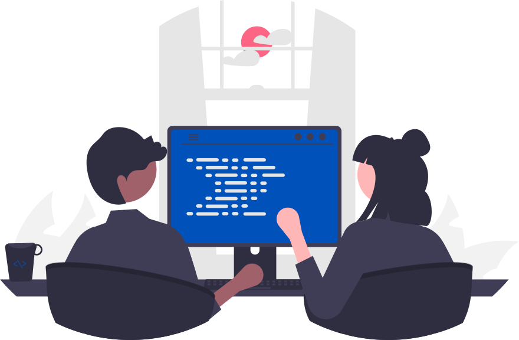

::: {.lead}
  We work on translational data science for [critical care]{.fw-bolder} and related specialties. We bring together four interrelated disciplines within the lab:

  1. Learning Healthcare Systems via nudge randomisation
  2. Algorithm stewardship and real world / real time decision support
  3. Collaborative data science and national level epidemiology
  4. Novel Non-Invasive Physiological Measurements and Assistance

:::

<!-- {.hero} -->

## Opportunities

::: {.callout-tip}
### Get in touch

We do not have allocated funding for new positions at the moment, but we are always happy to hear from people interested in our work. If you would like to collaborate or find out more, please [get in touch](mailto:s.harris@ucl.ac.uk).
:::

### Students

Undergraduate students work as **research assistants**, learning about the scientific method and assisting in the collection and processing of research data. Research assistants attend weekly lab meetings and can expect a **letter of recommendation** describing their work in and contributions to the lab (please give one month of advanced notice). Opportunities to earn **co-authorship** on research products (e.g., conference presentations) are also occasionally offered to advanced research assistants.

<!-- ## Email Us
hello@uclhal.org
-->
## Visit Us

The UCL Health Algorithm Laboratory is based at **Institute of Health Informatics** at University College London.

> **Street Address:** 222 Euston Road, London, NW1 2DA
```{=html}
<iframe src="https://www.google.com/maps/embed?pb=!1m18!1m12!1m3!1d2482.3081696623235!2d-0.137801584241075!3d51.52590731717089!2m3!1f0!2f0!3f0!3m2!1i1024!2i768!4f13.1!3m3!1m2!1s0x48761b260446fa31%3A0xc97a5981bb924a0d!2sUCL%20Institute%20Of%20Health%20Informatics!5e0!3m2!1sen!2suk!4v1668376825965!5m2!1sen!2suk" width="50%" height="450" style="border:0;" allowfullscreen="" loading="lazy" referrerpolicy="no-referrer-when-downgrade"></iframe>
```
